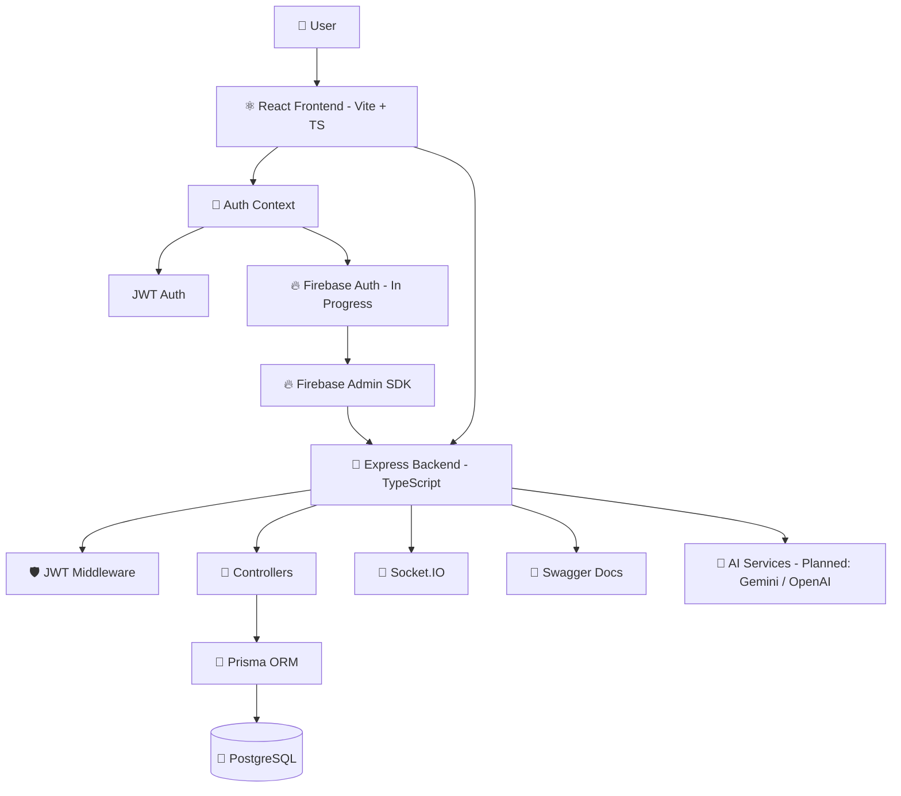
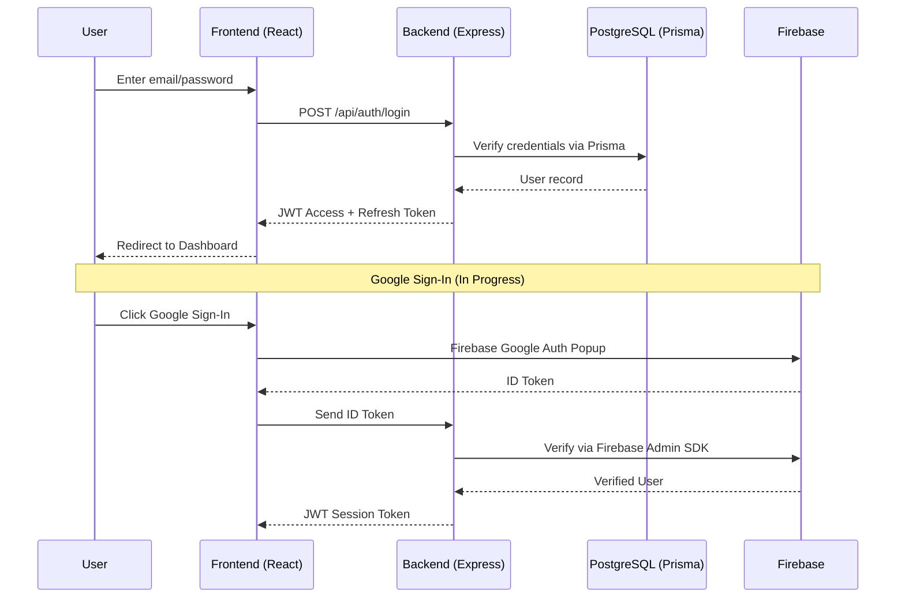

<div align="center">

<!-- Animated Gradient Header -->


<!-- Typing SVG -->
<a href="https://github.com/your-username/lifeos">
  
</a>

<br/>

<!-- Badges -->


</div>

---

## 📖 Table of Contents

- [Overview](#-overview)
- [Features](#-features)
- [Tech Stack](#-tech-stack)
- [Architecture](#-architecture)
- [Folder Structure](#-folder-structure)
- [Authentication Flow](#-authentication-flow)
- [Database Documentation](#-database-documentation)
- [Firebase Documentation](#-firebase-documentation)
- [Backend Documentation](#-backend-documentation)
- [Frontend Documentation](#-frontend-documentation)
- [Installation Guide](#-installation-guide)
- [Environment Variables](#-environment-variables)
- [API Documentation](#-api-documentation)
- [Screenshots](#-screenshots)
- [Demo](#-demo)
- [GitHub Repository Setup](#-github-repository-setup)
- [Security Best Practices](#-security-best-practices)
- [Deployment Guide](#-deployment-guide)
- [Current Project Status](#-current-project-status)
- [Known Issues](#-known-issues)
- [Future Roadmap](#-future-roadmap)
- [Contributing](#-contributing)
- [License](#-license)
- [Credits](#-credits)

---

## 🌟 Overview

**LifeOS** is a full-stack, AI-powered personal productivity platform built to bring your entire life into a single dashboard. Instead of juggling separate apps for tasks, finances, notes, goals, and habits, LifeOS aims to unify them into one connected system — enhanced by AI assistance and analytics.

**Why LifeOS exists:**
Modern productivity is fragmented across too many disconnected tools. LifeOS is being built to solve that by combining task management, finance tracking, notes, goals, habits, and AI assistance into one cohesive application.

**Target Users:**
- Individuals who want a single source of truth for their daily life
- Developers/students looking for an open-source productivity OS to learn from or contribute to
- Early adopters interested in AI-assisted personal management tools

**Current Stage:** LifeOS is in **active early-stage development**. Core authentication, backend infrastructure, and dashboard foundations are working. Firebase/Google login, AI integration, and deployment are in progress or planned.

---

## ✨ Features

### 🔐 Authentication
- ✅ Email & Password Authentication
- ✅ JWT Authentication (Access + Refresh tokens)
- 🚧 Firebase Authentication
- 🚧 Google Sign-In

### 📊 Dashboard
- ✅ Dashboard screens (foundation)

### ✅ Task Management
- ✅ Task Management foundation

### 💰 Finance
- ✅ Finance foundation

### 📝 Notes
- ✅ Notes foundation

### 🎯 Goals
- ✅ Goal Management foundation

### 🤖 AI
- 📅 Google Gemini API integration (Planned)
- 📅 OpenAI API integration (Planned)
- 📅 AI Assistant (Planned)
- 📅 AI Voice Assistant (Planned)

### 📈 Analytics
- 📅 Analytics (Planned)

### 🛡️ Security
- ✅ JWT-based secure authentication
- 🚧 Firebase Admin SDK verification

### ⚙️ Backend
- ✅ Express.js server (TypeScript)
- ✅ Prisma ORM configured
- ✅ Swagger API documentation
- ✅ Socket.IO initialized

### 🎨 Frontend
- ✅ React + Vite + TypeScript app
- ✅ Auth Context, Services, Components folders
- ✅ Sign In / Create Account pages
- 🚧 Tailwind CSS (partial)

### 🗄️ Database
- ✅ PostgreSQL configured
- ✅ Prisma schema pushed successfully

---

## 🛠️ Tech Stack

| Category | Technology |
|---|---|
| **Frontend** | React, TypeScript, Vite |
| **Frontend Libraries** | React Context API, React Icons, Motion |
| **Styling** | Tailwind CSS (planned/partial) |
| **Backend** | Node.js, Express.js, TypeScript |
| **Database** | PostgreSQL |
| **ORM** | Prisma ORM |
| **Authentication** | JWT (current), Firebase Auth + Google Sign-In (in progress) |
| **AI (Planned)** | Google Gemini API, OpenAI API |
| **Real-time** | Socket.IO |
| **API Docs** | Swagger |
| **Dev Tools** | tsx, npm, Git/GitHub |

---

## 🏗️ Architecture



### Authentication Sequence (Current + In Progress)



---

## 📁 Folder Structure

```
LifeOS/
├── frontend/
│   ├── src/
│   │   ├── contexts/          # Auth Context and other React contexts
│   │   ├── services/          # API service layer
│   │   ├── components/        # Reusable UI components
│   │   ├── screens/           # Sign In, Create Account, Dashboard screens
│   │   └── firebase.ts        # Firebase client configuration
│   ├── .env.example
│   └── vite.config.ts
│
├── backend/
│   ├── src/
│   │   ├── controllers/       # Route logic
│   │   ├── routes/            # API route definitions
│   │   ├── middleware/        # JWT / auth middleware
│   │   └── services/          # Business logic, Firebase Admin, etc.
│   ├── prisma/
│   │   └── schema.prisma      # Database schema
│   ├── .env.example
│   └── package.json
│
├── .gitignore
└── README.md
```

> 📌 **Note:** Exact internal file names within `controllers/`, `routes/`, and `services/` were not detailed in the source conversation and are omitted rather than invented.

---

## 🔑 Authentication Flow

LifeOS currently supports **Email/Password + JWT authentication**, with **Firebase Google Sign-In** actively being integrated.

| Method | Status |
|---|---|
| Email/Password | ✅ Completed |
| JWT (Access + Refresh) | ✅ Completed |
| Firebase Authentication | 🚧 In Progress |
| Google Sign-In | 🚧 In Progress (popup issues being debugged) |
| Backend Firebase Verification | 🚧 In Progress (Admin SDK setup incomplete) |

**Current known issue:** Google Sign-In popup does not work correctly (`auth/configuration-not-found`), and the backend Firebase Admin SDK environment variables still require proper configuration.

---

## 🗄️ Database Documentation

- **Database:** PostgreSQL
- **ORM:** Prisma
- **Status:** ✅ Installed, configured, connected — schema pushed successfully

| Item | Status |
|---|---|
| PostgreSQL Installation | ✅ Completed |
| Prisma Configuration | ✅ Completed |
| Prisma Client Generation | ✅ Completed |
| Database Connection | ✅ Established |
| Schema Push | ✅ Successful |

**Historical issues resolved/encountered along the way:**
- `DATABASE_URL` formatting errors
- PostgreSQL connection failures
- PostgreSQL service being stopped unexpectedly
- Prisma `P1001` connection errors

> 📌 Specific Prisma models and table relationships were not detailed in the provided conversation, so they are not documented here to avoid inventing schema structure.

---

## 🔥 Firebase Documentation

| Item | Status |
|---|---|
| Firebase Project Created | ✅ Completed |
| Web App Registered | ✅ Completed |
| Firebase SDK Installed | ✅ Completed |
| `firebase.ts` Config File | ✅ Created |
| Google Authentication | 🚧 In Progress |
| Firebase Admin SDK (Backend) | 🚧 Incomplete |
| Service Account JSON | ✅ Downloaded (needs secure configuration) |

**Backend expects the following Firebase Admin credentials:**
```
FIREBASE_PROJECT_ID
FIREBASE_CLIENT_EMAIL
FIREBASE_PRIVATE_KEY
```

**Known Firebase issues:**
- `auth/configuration-not-found` error
- Google Sign-In popup malfunctioning
- Backend initially missing a Firebase verification endpoint
- Firebase Admin SDK configuration incomplete

---

## ⚙️ Backend Documentation

- **Framework:** Express.js (TypeScript)
- **ORM:** Prisma
- **API Docs:** Swagger
- **Real-time:** Socket.IO

| Component | Status |
|---|---|
| Express Server | ✅ Starts successfully |
| Swagger Documentation | ✅ Available |
| Socket.IO | ✅ Initialized |
| JWT Authentication | ✅ Implemented |
| Email/Password Auth | ✅ Implemented |
| Firebase Verification Endpoint | 🚧 In Progress |

**Known backend issues:**
- `tsx` dependency missing when backend was copied to a new location
- Firebase Admin SDK environment variables missing

---

## 🎨 Frontend Documentation

- **Framework:** React + Vite + TypeScript
- **State Management:** React Context API

| Component | Status |
|---|---|
| React App | ✅ Set up |
| Vite Configuration | ✅ Set up |
| Auth Context | ✅ Implemented |
| Sign In Page | ✅ Implemented |
| Create Account Page | ✅ Implemented |
| Dashboard Screens | ✅ Implemented (foundation) |
| Google Sign-In Button (UI) | ✅ Icon present, 🚧 functionality in progress |
| Tailwind CSS | 🚧 Partial |

---

## 🚀 Installation Guide

> ⚠️ Exact package names and scripts beyond what's below were not specified in the provided conversation. Commands follow standard conventions for the described stack.

### 1. Clone the repository
```bash
git clone https://github.com/your-username/lifeos.git
cd lifeos
```

### 2. Backend Setup
```bash
cd backend
npm install
```

### 3. Configure PostgreSQL & Prisma
```bash
# Ensure PostgreSQL is running locally
# Configure DATABASE_URL in backend/.env (see Environment Variables section)

npx prisma generate
npx prisma db push
```

### 4. Run the Backend
```bash
npm run dev
```

### 5. Frontend Setup
```bash
cd ../frontend
npm install
```

### 6. Run the Frontend
```bash
npm run dev
```

---

## 🔐 Environment Variables

> ⚠️ Never commit real `.env` files. Use the templates below.

### `backend/.env.example`
```env
# Database
DATABASE_URL=

# JWT
JWT_ACCESS_SECRET=
JWT_REFRESH_SECRET=

# Google OAuth
GOOGLE_CLIENT_ID=
GOOGLE_CLIENT_SECRET=

# Firebase Admin SDK
FIREBASE_PROJECT_ID=
FIREBASE_CLIENT_EMAIL=
FIREBASE_PRIVATE_KEY=

# AI (Planned)
GEMINI_API_KEY=
OPENAI_API_KEY=
```

### `frontend/.env.example`
```env
VITE_API_URL=

VITE_FIREBASE_API_KEY=
VITE_FIREBASE_AUTH_DOMAIN=
VITE_FIREBASE_PROJECT_ID=
VITE_FIREBASE_STORAGE_BUCKET=
VITE_FIREBASE_MESSAGING_SENDER_ID=
VITE_FIREBASE_APP_ID=
VITE_FIREBASE_MEASUREMENT_ID=
```

---

## 📡 API Documentation

> 📌 Specific API endpoints (routes/methods) were not explicitly listed in the provided conversation. Below is the documented **API infrastructure only** — please update this section with exact endpoints as they are finalized.

| Component | Status |
|---|---|
| Swagger API Docs | ✅ Available at backend runtime |
| Auth API (Email/Password, JWT) | ✅ Implemented (exact routes not specified) |
| Firebase Verification Endpoint | 🚧 In Progress |
| Task / Finance / Notes / Goals APIs | 🚧 Foundation exists — routes not detailed |

<details>
<summary><strong>📝 Template for documenting endpoints (fill in as finalized)</strong></summary>

| Method | Endpoint | Purpose | Auth Required |
|---|---|---|---|
| POST | `/api/auth/register` | Register new user | ❌ |
| POST | `/api/auth/login` | Login with email/password | ❌ |
| POST | `/api/auth/google` | Verify Firebase Google token | ❌ |
| GET | `/api/tasks` | Fetch user tasks | ✅ |

</details>

---

## 🖼️ Screenshots

> Screenshots not yet provided — placeholders below.

| Screen | Preview |
|---|---|
| Dashboard | `screenshots/dashboard.png` |
| Login | `screenshots/login.png` |
| Tasks | `screenshots/tasks.png` |
| Profile | `screenshots/profile.png` |

---

## 🎬 Demo

- 🔗 **Live Demo:** _Coming soon_
- 🎥 **Video Demo:** _Coming soon_
- 🖼️ **GIF Preview:** `demo.gif` (placeholder)
- 🌐 **Website:** _Not yet deployed_

---

## 🗂️ GitHub Repository Setup

Recommended files for a healthy open-source repository:

- [x] `.gitignore`
- [ ] `LICENSE`
- [x] `README.md`
- [ ] `.env.example`
- [ ] `CONTRIBUTING.md`
- [ ] `CODE_OF_CONDUCT.md`
- [ ] `SECURITY.md`
- [ ] `CHANGELOG.md`

**Current `.gitignore` excludes:**
```
node_modules
.env
firebase-admin.json
service-account-key.json
build/
dist/
```

---

## 🛡️ Security Best Practices

**Never upload the following to GitHub:**

| Item | Why |
|---|---|
| `.env` files | Contain database URLs, JWT secrets, and API keys |
| Firebase Service Account JSON | Grants full admin access to your Firebase project |
| JWT Secrets | Allow forging authentication tokens if leaked |
| API Keys (Gemini, OpenAI) | Can lead to unauthorized billing/usage |
| Database Passwords | Direct access to production/user data |

Always verify `.gitignore` is correctly excluding these before every commit, and rotate any credentials that may have been accidentally exposed.

---

## 🚢 Deployment Guide

> 📌 Deployment has **not yet been completed**. Below is a planned outline based on the current stack.

| Component | Planned Approach | Status |
|---|---|---|
| Frontend | Vite build → static hosting (e.g., Firebase Hosting/Vercel) | 📅 Planned |
| Backend | Node/Express hosting (e.g., Render, Railway, VPS) | 📅 Planned |
| Database | Managed PostgreSQL instance | 📅 Planned |
| Firebase | Firebase Hosting + Auth in production | 📅 Planned |
| Environment Variables | Configure secrets in host's environment settings | 📅 Planned |

**Production Checklist (Planned):**
- [ ] Move all secrets to secure environment variable storage
- [ ] Enable HTTPS
- [ ] Set up production PostgreSQL instance
- [ ] Complete Firebase Admin SDK configuration
- [ ] Finalize Google Sign-In flow
- [ ] Add monitoring/logging

---

## 📊 Current Project Status

| Area | Status |
|---|---|
| React Frontend | ✅ Working |
| Express Backend | ✅ Working |
| PostgreSQL | ✅ Working |
| Prisma | ✅ Working |
| JWT Authentication | ✅ Working |
| Firebase Authentication | 🟡 Partially Working |
| Google Login | 🟡 Partially Working |
| AI Integration | 🔴 Not Yet Completed |
| Production Deployment | 🔴 Not Yet Completed |
| Mobile Version | 🔴 Not Yet Completed |

---

## 🐞 Known Issues

### Database
- Prisma `DATABASE_URL` formatting errors
- PostgreSQL connection failures
- PostgreSQL service unexpectedly stopping
- Prisma `P1001` connection errors

### Firebase / Google Login
- `auth/configuration-not-found` error
- Google Sign-In popup not working correctly
- Firebase Admin SDK configuration incomplete

### Backend
- `tsx` dependency missing when backend was copied to a new environment
- Firebase Admin SDK environment variables missing
- Backend initially missing a Firebase verification endpoint

### Frontend
- Google Sign-In button exists in UI but currently non-functional

### Deployment
- No deployment has occurred yet — all deployment steps are planned

---

## 🗺️ Future Roadmap

### Version 1.1
- Complete Firebase Authentication & Google Sign-In
- Habit Tracker
- Notifications

### Version 2.0
- AI Assistant (Gemini / OpenAI integration)
- Calendar integration
- Cloud Sync

### Version 3.0
- AI Voice Assistant
- Mobile App
- Team Collaboration
- Advanced Analytics
- Dark Mode

---

## 🤝 Contributing

Contributions are welcome! LifeOS is in early development, and community input is valuable.

1. Fork the repository
2. Create a feature branch (`git checkout -b feature/your-feature`)
3. Commit your changes (`git commit -m "Add: your feature"`)
4. Push to your branch (`git push origin feature/your-feature`)
5. Open a Pull Request

Please open an issue first for major changes to discuss what you'd like to modify.

---

## 📄 License

This project is licensed under the **MIT License**.

```
MIT License

Copyright (c) 2025 LifeOS

Permission is hereby granted, free of charge, to any person obtaining a copy
of this software and associated documentation files (the "Software"), to deal
in the Software without restriction, including without limitation the rights
to use, copy, modify, merge, publish, distribute, sublicense, and/or sell
copies of the Software, subject to the following conditions:

The above copyright notice and this permission notice shall be included in
all copies or substantial portions of the Software.

THE SOFTWARE IS PROVIDED "AS IS", WITHOUT WARRANTY OF ANY KIND, EXPRESS OR
IMPLIED, INCLUDING BUT NOT LIMITED TO THE WARRANTIES OF MERCHANTABILITY,
FITNESS FOR A PARTICULAR PURPOSE AND NONINFRINGEMENT.
```

---

## 👤 Credits

**Developer:** _Your Name Here_

- GitHub: [@your-username](https://github.com/your-username)
- LinkedIn: [Your LinkedIn](https://linkedin.com/in/your-profile)
- Portfolio: [yourportfolio.com](https://yourportfolio.com)

---

<div align="center">

### Made with ❤️ and lots of ☕

**If you like this project, consider giving it a ⭐ on GitHub!**

🔓 Open Source · Built for learning, growth, and productivity


</div>
